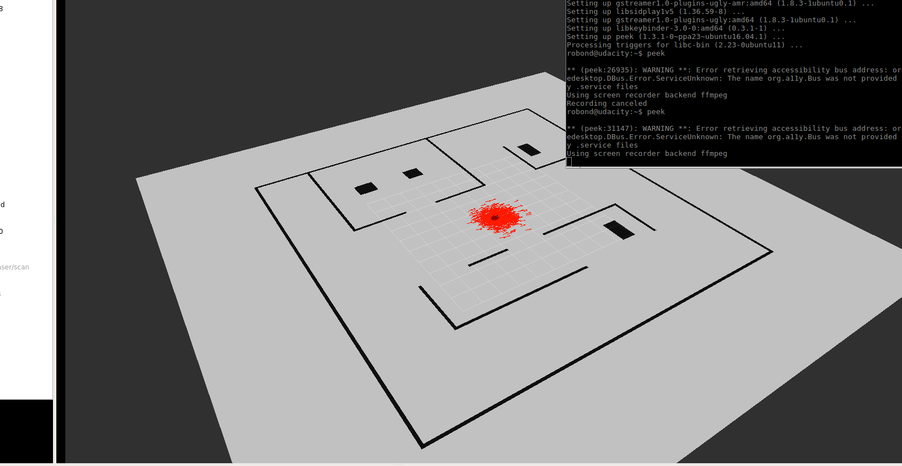

# Adaptive Monte Carlo Localization using ROS-AMCL package in a custom office environment.

I have build a custom office environment using GAZEBO world builder.
Robot is a two-wheeled, and equipped with a camera and a LIDAR.
Number of particles and path planning parameters can be tweaked in amcl.launch and the config folder.

### To run:
```sh
$ cd <your catkin workscape>/src
$ git clone https://https://github.com/zvatansever/AdaptiveMonteCarloLocalization
$ cd ..
$ catkin_make
$roslaunch AdaptiveMonteCarloLocalization world.launch
``

